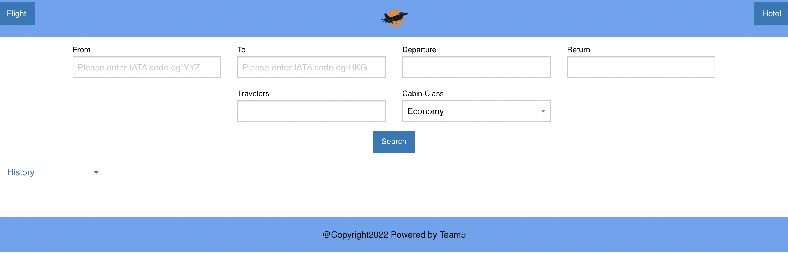

# Project01-FlightPlanner

## Overview

User Story:

As a traveler, I would like to acquire information that’ll strategically assist me on arranging my trip effortlessly

Acceptance Criteria: 

GIVEN I am a traveler, 

WHEN I input my requirement (number of people, start location, destination location, departure date, return date, cabin class), THEN I can see all the flight information for comparison. 

WHEN I continue to browse, THEN I can see some the recommended hotel of designation and their ratings. 

WHEN I click on book flight button, THEN I will be redirected to the booking website.

## Description

This project is to build a Flight and Hotel seaching website by calling server side API.

## Installation

N/A

## Usage

visit application URL: https://benliu104.github.io/Project01-FlightPlanner/

Step 1: Input the seaching Criteria 

Step 2: Click "Search" button, and the page will return Flight and hotel information.

Step 3: If want to make the flight booking, click "Book Flight" button. You will be redirect to external the booking page.

## Presentationo PowerPoint
https://docs.google.com/presentation/d/18-jTK2etNKfTMnuQy0EBmOOybl05hOUylL2T7H5DvCk/edit?usp=sharing

## Credits
Ben Liu: https://github.com/BenLiu104

Harmanjot Boparai: https://github.com/HarmanBoparai

Minh Thach: https://github.com/TsunomakiWatamee

## License
Please refer to the LICENSE in the repo.